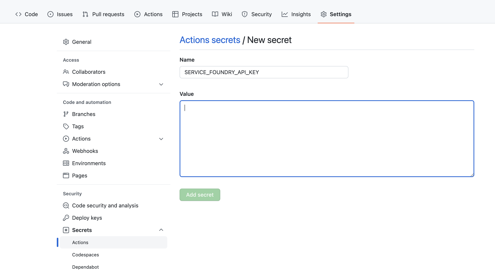

# mnist-truefoundry-example

If you clone this repo, do these things as well:
1. Replace the value of env var `TFY_RUN_ID` in `servicefoundry.yaml` with a run id from your own account. If you have any experiments, you can find your run id from the [TrueFoundry dashboard](https://app.truefoundry.com/mlfoundry)
2. Replace the workspace FQN in `servicefoundry.yaml` with one from your own account. You can create a new workspace or find the FQN of an existing workspace from the [dashboard](https://app.truefoundry.com/workspace)
3. Add the `SERVICE_FOUNDRY_API_KEY` secret required by Github Actions in your cloned repo's settings. You can find the API key [here](https://app.truefoundry.com/settings). More information about this [here](https://github.com/truefoundry/servicefoundry-cli/blob/main/docs/advance_examples/ci-pipeline-integration.md).

Now you should be all set to easily train, track and deploy models from this repo using TrueFoundry.